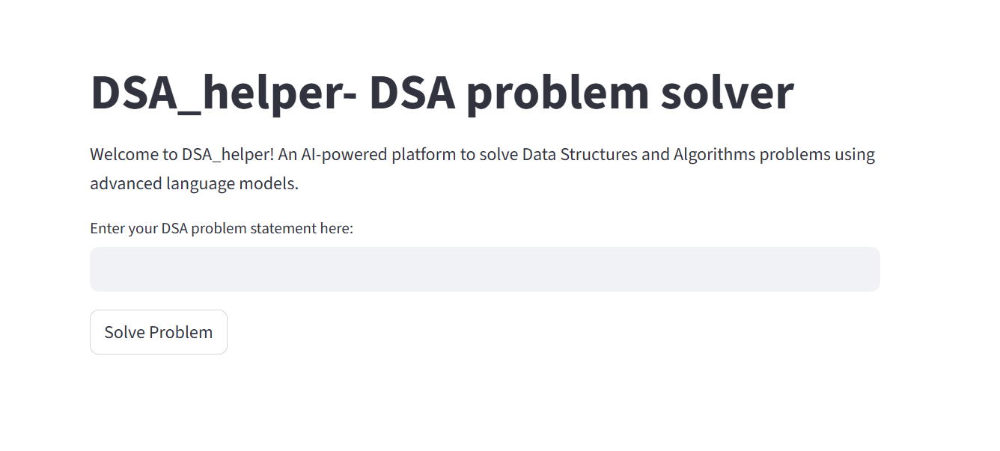
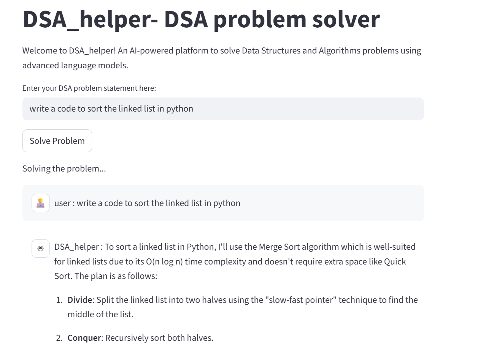

# AlgoGenie - AI-Powered DSA Problem Solver

AlgoGenie is an intelligent, AI-powered platform designed to solve Data Structures and Algorithms (DSA) problems using advanced language models and automated code execution. The system combines problem-solving capabilities with safe code execution in isolated Docker containers.

## 🚀 Features

- **AI-Powered Problem Solving**: Utilizes GPT-4o to understand and solve DSA problems
- **Automated Code Execution**: Safely executes Python code in isolated Docker containers
- **Interactive Web Interface**: Streamlit-based web application for easy problem input
- **Multi-Agent Architecture**: Collaborative problem-solving between specialized agents
- **Real-time Execution**: Streams execution results and provides immediate feedback
- **Test Case Generation**: Automatically generates and runs test cases for solutions

## 🏗️ Architecture

The project follows a multi-agent architecture with the following components:



### Core Components

- **Problem Solver Agent**: AI agent specialized in understanding and solving DSA problems
- **Code Executor Agent**: Handles code execution in secure Docker environments
- **DSA Team**: Orchestrates collaboration between agents using RoundRobinGroupChat
- **Docker Integration**: Provides isolated execution environment for code safety

### Project Structure

```
AlgoGenie/
├── agents/                    # AI agent implementations
│   ├── problem_solver.py     # Problem-solving agent
│   └── code_executor_agent.py # Code execution agent
├── assets/                   # Images and visual resources
│   ├── image1.png           # System architecture diagram
│   └── image2.png           # Workflow diagram
├── config/                   # Configuration and utilities
│   ├── constant.py          # System constants and settings
│   ├── docker_executor.py   # Docker execution setup
│   ├── docker_utils.py      # Docker container management
│   └── settings.py          # Model and API configuration
├── team/                     # Team orchestration
│   └── dsa_team.py         # DSA team setup and management
├── app.py                   # Streamlit web application
├── main.py                  # Command-line interface
└── requirements.txt         # Python dependencies
```

## 🛠️ Installation

### Prerequisites

- Python 3.8+
- Docker installed and running
- OpenAI API key

### Setup

1. **Clone the repository**
   ```bash
   git clone <repository-url>
   cd AlgoGenie
   ```

2. **Install dependencies**
   ```bash
   pip install -r requirements.txt
   ```

3. **Environment Setup**
   Create a `.env` file in the project root:
   ```env
   OPENAI_API_KEY=your_openai_api_key_here
   ```

4. **Verify Docker**
   Ensure Docker is running on your system:
   ```bash
   docker --version
   ```

## 🚀 Usage

### Web Interface (Recommended)

Run the Streamlit web application:

```bash
streamlit run app.py
```

Navigate to the provided URL and:
1. Enter your DSA problem statement
2. Click "Solve Problem"
3. Watch the AI solve your problem step by step

### Command Line Interface

Run the command-line version:

```bash
python main.py
```

The CLI version will solve a predefined problem and display the results.

## 🔧 Configuration

### Model Settings

Edit `config/constant.py` to modify:
- **MODEL**: AI model to use (default: 'gpt-4o')
- **MAX_TURNS**: Maximum conversation turns (default: 10)
- **TIMEOUT**: Code execution timeout in seconds (default: 120)

### Docker Settings

The system automatically:
- Creates isolated Docker containers for code execution
- Manages container lifecycle (start/stop)
- Uses a dedicated work directory for temporary files

## 🤖 How It Works



1. **Problem Input**: User provides a DSA problem statement
2. **Problem Analysis**: DSA_helper agent analyzes the problem and creates a solution plan
3. **Code Generation**: Python code is generated with test cases
4. **Code Execution**: Code is executed in isolated Docker container
5. **Result Analysis**: Execution results are analyzed and explained
6. **Completion**: Process continues until problem is solved or max turns reached

## 🔒 Security Features

- **Docker Isolation**: All code execution happens in isolated containers
- **Timeout Protection**: Automatic termination of long-running code
- **Work Directory Isolation**: Temporary files are contained in dedicated directories
- **API Key Protection**: Environment variable-based configuration

## 📋 Dependencies

- **Core AI**: `autogen-agentchat`, `autogen-core`, `autogen-ext`
- **Web Interface**: `streamlit`
- **AI Models**: `openai`
- **Container Management**: `autogen-ext[docker]`
- **Utilities**: `python-dotenv`, `tiktoken`

## 🐛 Troubleshooting

### Common Issues

1. **Docker Not Running**
   - Ensure Docker daemon is started
   - Verify Docker permissions

2. **API Key Issues**
   - Check `.env` file exists and contains valid OpenAI API key
   - Verify API key has sufficient credits

3. **Dependencies Issues**
   - Update pip: `pip install --upgrade pip`
   - Reinstall requirements: `pip install -r requirements.txt --force-reinstall`

### Debug Mode

For debugging, check the console output for detailed error messages and execution logs.

## 🤝 Contributing

1. Fork the repository
2. Create a feature branch
3. Make your changes
4. Add tests if applicable
5. Submit a pull request

## 📄 License

This project is licensed under the MIT License - see the LICENSE file for details.

## 🙏 Acknowledgments

- Built with [AutoGen](https://github.com/microsoft/autogen) framework
- Powered by OpenAI's GPT models
- Containerization support via Docker

## 📞 Support

For issues, questions, or contributions, please:
- Open an issue on GitHub
- Check the troubleshooting section
- Review the configuration options

---

**AlgoGenie** - Making DSA problem-solving intelligent and accessible! 🧠✨
